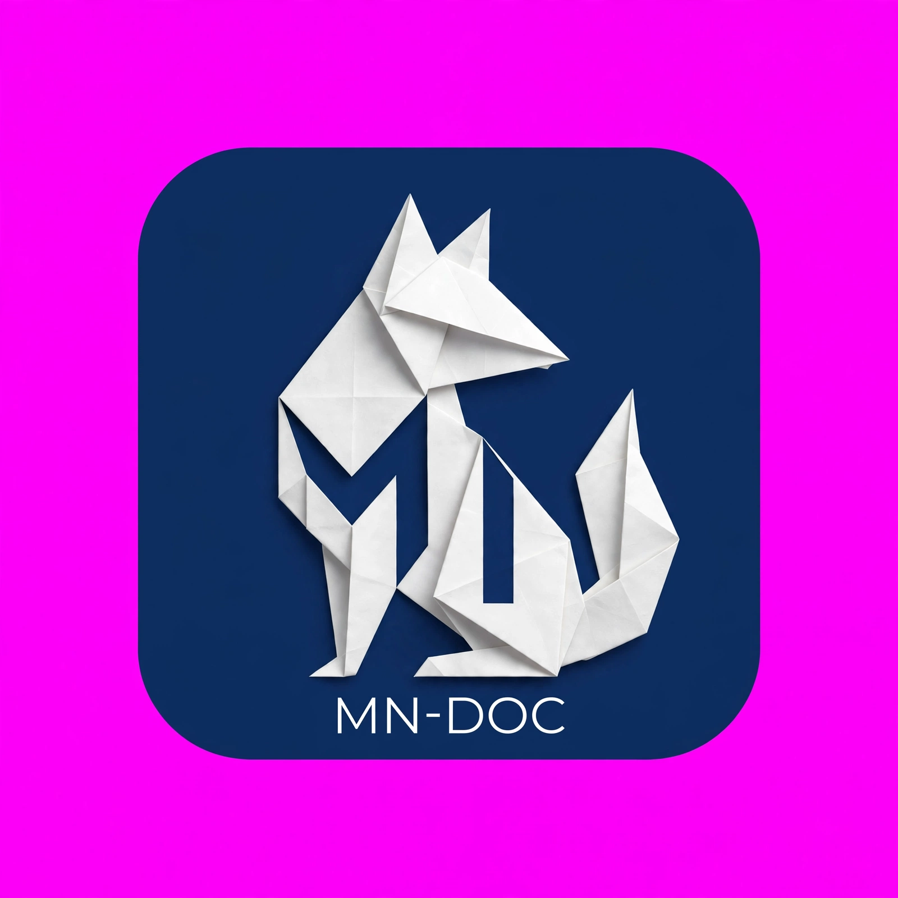

# MN-Doc

<p align="center">
  <strong>محرر مستندات احترافي متكامل لنظام أندرويد</strong><br>
  عرض وتحرير PDF، ذكاء اصطناعي، مسح ضوئي، وأدوات مستندات متقدمة — بواجهة عربية أولاً ودعم لست لغات.
</p>

<p align="center">
  
</p>

---

## نظرة عامة

**MN-Doc** تطبيق أندرويد مبني بـ Flutter/Dart، يجمع بين محرر PDF كامل الميزات، أدوات معالجة مستندات متقدمة، وميزات ذكاء اصطناعي — مع تركيز خاص على دعم اللغة العربية (اتجاه RTL، وخط عربي مضمّن لضمان ظهور صحيح للنصوص المصدَّرة).

الواجهة مترجمة بالكامل إلى **6 لغات**: العربية، الإنجليزية، الألمانية، الفرنسية، التركية، والبولندية.

---

## الميزات

### 📄 تحرير ومعالجة PDF
- عرض وتحرير المستندات: إضافة نص (مع تحكم بالحجم واللون وموضعه)، تظليل، تسطير، شطب، ملاحظات لاصقة
- بحث نصي داخل المستند، وفهرس (Bookmarks)
- تعبئة نماذج PDF التفاعلية (AcroForms)
- دمج عدة ملفات، حذف/إعادة ترتيب الصفحات، تدوير الصفحات، اكتشاف وحذف الصفحات الفارغة تلقائيًا
- مقارنة نصية بين ملفين وإظهار الفروقات
- حماية/إزالة كلمة مرور (تشفير AES 256-bit)، علامة مائية نصية، ضغط حجم الملف
- تعديل/حذف نص موجود بالملف (تغطية واستبدال)
- إصلاح تلقائي لمشاكل الفهرسة الشائعة بالملفات التالفة جزئيًا
- استخراج تقريبي للجداول وتصديرها كملف Excel
- طباعة مباشرة عبر طابعات لاسلكية
- تراجع/إعادة (Undo/Redo)، تكبير/تصغير باللمس، حفظ آمن (Atomic Save)

### 🔄 تحويل الصيغ
- صور ↔ PDF (تجميع عدة صور بملف واحد، أو تصدير أي صفحة كصورة)
- Word (.docx) → PDF (استخراج نصي)

### 🔍 مسح ضوئي وتعرّف على النصوص
- مسح ضوئي بكشف حواف مستند حقيقي (Google ML Kit Document Scanner) مع تصحيح زاوية وقصّ تلقائي
- تحسين تلقائي للصفحات (تحويل لأبيض وأسود بتباين قابل للتعديل)
- تعرّف ضوئي على النصوص (OCR) بوضعين: مجاني بدون إنترنت (إنجليزي/صيني/ياباني/كوري)، أو بالذكاء الاصطناعي (يدعم العربية وكل اللغات)
- التعرف على رموز QR والباركود

### 🤖 ذكاء اصطناعي (Gemini API — فئة مجانية)
- تلخيص ذكي (مع تلخيص محلي مجاني كخيار افتراضي بدون إنترنت)
- مساعد دردشة للسؤال عن محتوى أي مستند
- تعرّف ضوئي ذكي يدعم العربية والصور المعقدة

> ميزات الذكاء الاصطناعي اختيارية بالكامل وتحتاج مفتاح Gemini API شخصي مجاني ([الحصول عليه](https://aistudio.google.com/apikey)) — بقية ميزات التطبيق (بما فيها الترجمة والتعرف الضوئي الأساسي) تعمل بالكامل بدون إنترنت وبدون أي مفتاح.

### ✍️ التوقيع والصوت
- رسم وحفظ عدة توقيعات وأختام لإعادة استخدامها
- إملاء صوتي (تحويل كلام إلى نص) وحفظه كمستند PDF
- قراءة أي مستند بصوت عالٍ (Text-to-Speech)

### 📂 إدارة الملفات
- مدير ملفات متكامل: الكل، المفضلة، سلة محذوفات (حذف مؤقت قابل للاستعادة)، بحث بالاسم
- ترجمة (على الجهاز، بدون إنترنت) بين أكثر من 10 لغات

### ⚙️ الإعدادات
- المظهر: فاتح / ليلي / حسب النظام
- اللغة: 6 لغات مدعومة بالكامل
- ملف شخصي محلي (اسم فقط، محفوظ على الجهاز)
- التحقق من وجود تحديثات

---

## البنية التقنية

| الطبقة | التقنية |
|---|---|
| اللغة وإطار العمل | Dart / Flutter |
| عرض وتحرير PDF | Syncfusion Flutter PDF / PDF Viewer |
| التعرف الضوئي والترجمة والباركود | Google ML Kit (on-device) |
| كشف حواف المستند | Google ML Kit Document Scanner |
| الذكاء الاصطناعي | Google Gemini API |
| التحويل الصوتي | flutter_tts / speech_to_text |
| إنشاء ملفات PDF/Excel | pdf, excel (Dart) |
| إدارة الحالة | Provider |
| التخزين المحلي | SharedPreferences |
| البناء والنشر المستمر | GitHub Actions |

---

## متطلبات التشغيل والبناء

- Flutter SDK (القناة المستقرة)
- Android SDK (compileSdk 36)
- JDK 17

```bash
flutter pub get
flutter pub run flutter_launcher_icons
flutter build apk --release
# أو لرفع على Google Play:
flutter build appbundle --release
```

يُبنى التطبيق تلقائيًا عبر GitHub Actions عند كل دفع (push) على الفرع الرئيسي، وينشر إصدارًا عامًا (Release) عند دفع "تاغ" بصيغة `v*`.

---

## الخصوصية والأمان

- كل الملفات والإعدادات تُخزَّن محليًا على الجهاز فقط — لا يوجد خادم خاص بالتطبيق
- توقيع رقمي حقيقي للإصدارات (Android App Signing)
- راجع [سياسة الخصوصية الكاملة](https://awsnuaimi.github.io/mn.doc/privacy-policy.html) ([English](https://awsnuaimi.github.io/mn.doc/privacy-policy-en.html))

---

## الترخيص

هذا المشروع مغلق المصدر تجاريًا. جميع الحقوق محفوظة.
